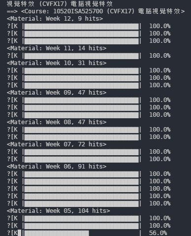

# iLMS NTHU

An iLMS client for stduents, assistants and developers.



## Install

```bash
pip install -U ilms-nthu
```

*Note: develop and test on Python3.5+*


## Command

- View all taken courses

```bash
ilms view courses
```

- Download all course materials

```bash
ilms download material --course_id CS35700

# keyword of course id
ilms download material --course_id 35700

# keyword of course name
ilms download material --course 多媒體

ilms download material --course CVFX

```

- Download all hand-in homeworks of students

```bash
ilms download handin --course_id CS35700 --hw_title Homework1
```

- Grade hand-ins of students with single `csv` file

```bash
ilms score --course_id CS35700 --hw_title Homework1 --score_csv hw1-cs3570.csv
```


## Sample code

### Login to iLms

- You need login for any operations that need privileges.
- login with helper function `get_account()`

```python
from ilms.core import User
from ilms.core import Core as iLms
from ilms.utils import get_account

user = User(*get_account())
assert user.login()

# You can take your profile
profile = ilms.get_profile()

ilms = iLms(user)
```

### Query for courses

```python
# iterate through courses with loop
for cou in ilms.get_courses():
    cou.course_id
    print(cou)

# query with 'keyword', can be coures_id or partial course name in `en` or `zh`
courses = ilms.get_courses()
cou = courses.find(course_id='CS35700')
cou = courses.find(name='視覺特效')
cou = courses.find(name='Pattern Recog')

```

### Download all course materials

```python
for material in cou.get_materials():
    print(material)
    material.download(root_folder='download/cvfx/')
```

### Download all hand-in homeworks

```python
from ilms.utils import load_score_csv

homeworks = cou.get_homeworks()
hw1 = homeworks.find(title='Homework1')

hw1.download_handins()
```

### Grade the homeworks

- Use helper function `load_score_csv()` to load the scores in csv file (contains only two columns, `student id` and `score`)
- Can do some processes on the `score_map`, and then use `score_hanins` method to grading in bulk.

```python
from ilms.utils import load_score_csv

homeworks = cou.get_homeworks()
hw1 = homeworks.find(title='Homework1')

score_map = load_score_csv('hw1-cs35700.csv')
score_map = {
    student_id: math.ceil(score)
    for student_id, score in score_map.items()}

hw1.score_handins(score_map)
```

### Full sample

```python
from ilms.core import User
from ilms.core import Core as iLms


''' 1. get your profile '''
profile = ilms.get_profile()

''' 2. iterate through all your courses '''
for cou in ilms.get_courses():

    ''' 2.a find out all homewrok information '''
    for homework in cou.get_homeworks():

        ''' 3. if you're TA, you should get this feature
               to explore all the students' works !
               [View the detail / Download files]
        '''
        for handin in homework.handin_list:
            pprint(handin.detail)
            handin.download()

    ''' 4. You can download all materials in few lines ! '''
    for material in cou.get_materials():
        print(material.detail)
        material.download()

    print(cou.get_forum_list().result)
```

### Smart query container

Even, with `smart query` feature

```python

courses = ilms.get_courses()

''' get the specific course with keyword '''
course = courses.find(course_id='CS35700')

homeworks = course.get_homeworks()

''' get the specific homework (in two ways) '''
hw1 = homeworks.get(0)
hw1 = homeworks.find(title='Homework1')

''' get the specific haned_in homework '''
handin = hw1.get(87)
handin = hw1.handin_list.find(authour='王曉明')
handin = hw1.handin_list.find(date='2017-03-25')

```
